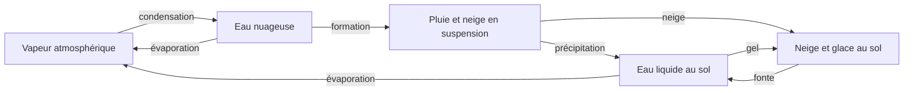

# Atmosphère volumétrique GPU

TerraGPU associe désormais deux domaines : une surface en heightfield 2.5D pour
le relief et les fluides, et une atmosphère véritablement 3D. La grille
atmosphérique contient **48 × 48 × 32 = 73 728 voxels**. Chaque position
horizontale possède plusieurs niveaux d'air qui évoluent séparément. Le vent
possède trois composantes, dont une vitesse verticale, et les échanges lisent
les voisins selon les trois axes. Les coupes visibles sont des diagnostics de
ce volume, pas les seules couches simulées.

Il s'agit d'une mini-simulation qualitative destinée à l'exploration visuelle.
La représentation et les coefficients sont simplifiés : ni les distances, ni
les temps, ni les vitesses affichées ne constituent une calibration
météorologique à l'échelle d'un paysage réel.

## Fonctionnement

Les états évoluent dans des buffers de stockage WebGPU. Le CPU transmet les
paramètres et ordonne les passes ; le transport et les mises à jour des cellules
sont calculés sur le GPU.

- L'advection semi-lagrangienne avec interpolation trilinéaire transporte le
  vent et la température dans les trois dimensions. L'eau atmosphérique
  utilise un transport conservatif par volumes finis : un flux sortant par
  une face est exactement le flux entrant de la cellule voisine. Un limiteur
  borne les sorties par la quantité disponible dans la cellule donneuse.
- Les échanges thermiques entre sol et air, le chauffage solaire, le
  refroidissement radiatif, l'albédo de la neige et l'inertie thermique
  produisent des contrastes de température locaux.
- La flottabilité compare la température locale à la moyenne de sa couche
  d'altitude pour créer des mouvements verticaux. Le transport vertical
  s'accompagne d'un changement de température adiabatique.
- Une projection de pression avec 12 itérations de Jacobi réduit la
  divergence du champ de vitesse. Les frontières horizontales sont
  périodiques ou fermées au choix ; le terrain et le plafond sont solides.
- L'humidité peut condenser en nuages, puis alimenter des précipitations.
- Le couplage avec la surface produit de la pluie ou de la neige suivant les
  conditions thermiques, permet le gel de l'eau et restitue de l'eau liquide
  lors de la fonte.

Chaque voxel conserve huit flottants : trois composantes du vent et une
température, puis la vapeur, l'eau nuageuse, la pluie et la neige. Les
précipitations se déplacent entre niveaux par sédimentation verticale. La
surface conserve séparément neige et glace en équivalent eau : lorsqu'une
quantité fond, elle est retirée du réservoir solide et ajoutée au champ
`water` des fluides. Ce liquide participe ensuite à l'écoulement existant.
La disparition visuelle de neige n'est donc pas seulement une modification de
couleur.

Pour transmettre une précipitation de la grille atmosphérique à la surface
fine, le couplage utilise une interpolation bilinéaire dont les poids sont
normalisés selon les aires représentées. Cette répartition préserve le budget
de dépôt et évite d'imprimer les limites des colonnes atmosphériques dans la
neige. La température de l'air utilisée pour l'échange thermique au sol est
elle aussi interpolée. Cela lisse le couplage entre résolutions ; la
résolution de la dynamique atmosphérique reste de 48 × 48 × 32.

## Cycle de l'eau fermé et frontières

**Closed water cycle est activé par défaut** (`config.closedWaterCycle = true`).
L'eau se déplace entre réservoirs internes :

L'évaporation retire uniquement l'eau liquide disponible, puis crédite cette
même quantité au budget destiné à l'air. La vapeur en attente d'injection
reste un réservoir comptabilisé, y compris lorsqu'une colonne ne contient pas
d'air disponible. La chaleur peut accélérer ce transfert, elle ne crée pas
d'eau. **Solar evaporation** règle son coefficient de 0 à 1, avec 0,25 par
défaut. L'ancien curseur **Water Evaporation** devient **Extra evaporation
(returned to air)** dans ce mode : son prélèvement rejoint également l'air.

Le mode fermé force les bords de surface à **Block all**, suspend la pluie
manuelle et désactive tout rappel d'humidité vers une valeur imposée, même
si la température et le vent utilisent le mode forcé. Les contrôles manuels
incompatibles affichent l'état effectif et sont désactivés. Leurs valeurs
choisies restent mémorisées pour le retour au mode ouvert.

Les **frontières de l'atmosphère** sont indépendantes de celles de l'eau de
surface :

| Réglage | Ce qui arrive au bord horizontal | Conséquence sur l'eau |
| --- | --- | --- |
| Periodic | L'air qui sort à droite rentre à gauche ; celui qui sort devant rentre derrière, avec les mêmes quantités transportées. | Aucune perte vers l'extérieur : les bords opposés sont reliés. |
| Closed walls | La vitesse normale au mur est bloquée ; l'air doit circuler à l'intérieur du domaine. | Aucun flux d'eau atmosphérique à travers les murs. |

Le sol et le plafond sont fermés dans les deux cas. La pluie qui atteint le
sol rejoint les réserves de surface. Une frontière périodique ne signifie
donc pas que le monde est ouvert : elle referme les axes horizontaux sur
eux-mêmes. Dans le mode fermé, l'eau liquide de surface reste contenue par
ses propres bords bloquants, même lorsque l'air utilise les bords périodiques.

La désactivation de **Closed water cycle** rend de nouveau actifs les
réglages de pluie manuelle, de frontières de surface et, en mode forcé, de
rappel d'humidité. Ces fonctions peuvent alors apporter ou retirer de l'eau.
Cela ne transforme pas les frontières atmosphériques en bords ouverts :
leur sélection périodique ou fermée continue de s'appliquer.

Le panneau **Water inventory** mesure la somme de l'eau liquide, des solides,
de la vapeur, des nuages, des précipitations en vol et des transferts en
attente. Entre interventions, l'évolution fermée conserve ce total à la
précision des calculs flottants. La répartition entre réservoirs peut changer
fortement pendant que le total reste stable. Les différences d'arrondi et
leur accumulation se lisent dans l'écart affiché, elles ne doivent pas être
confondues avec une nouvelle source physique.

Les pinceaux ajoutant ou effaçant de l'eau, les presets, **Restart air** et les réinitialisations sont des
interventions volontaires : ils peuvent ajouter, retirer ou remplacer de
l'eau, et définissent un nouveau bilan de référence. Redémarrer l'air humide
apporte par exemple un nouvel inventaire de vapeur même si le sol est
préservé. Comparer la dérive seulement après la fin de ces interventions.

## Météo émergente et mode forcé

**Le mode émergent est activé par défaut** (`config.emergentWeather = true`).
Il n'applique aucun rappel continu de la température, de l'humidité ou du vent
vers les curseurs. Ces valeurs définissent l'état initial de l'air et sont
appliquées par **Restart air** ou par un preset. Le vent horizontal initial
vaut zéro par défaut. Le volume évolue ensuite à partir de cet état, du
relief, des échanges sol–air, des changements de phase et des sources
d'énergie.

Le soleil reste une entrée externe : son intensité, son élévation et son
azimut règlent l'échauffement selon l'exposition du sol. Le refroidissement
radiatif règle les pertes de chaleur. Ces paramètres s'appliquent immédiatement
pendant la simulation. Il n'y a pas de cycle jour/nuit automatique impliqué
par ces curseurs. La température et le vent sont des résultats dynamiques ;
leur évolution ne garantit pas une circulation spectaculaire sur un terrain
uniforme à chaque instant.

Le **mode forcé**, optionnel, rétablit le rappel continu de l'air vers les
références de température et de vent. Le rappel d'humidité n'est actif que
si **Closed water cycle** est désactivé ; sinon son curseur reste une
condition initiale. Le mode forcé apporte de la chaleur et du mouvement, et
peut également apporter ou retirer de l'eau en mode ouvert.

En mode émergent ou en cycle fermé, changer un preset redémarre l'air avec ses conditions initiales et réactive la
météo. **Restart air** applique les curseurs courants de la même manière. Ces
actions conservent le terrain, sa température, l'eau liquide, la neige et la
glace. Elles remplacent l'état atmosphérique et ne constituent pas une
évolution fermée de ce dernier. **Reset Weather** est la réinitialisation plus
large qui efface aussi neige et glace.

## Temps et résolutions

L'atmosphère utilise une horloge à pas fixe de 1/30 s, avec un maximum de quatre
pas par image pour éviter une accumulation de travail après un ralentissement.
Le facteur **Simulation Speed** général et **Weather speed** modulent cette
horloge. En surcharge, ce plafond privilégie la stabilité et peut ralentir le
temps simulé par rapport au temps réel.

La résolution atmosphérique est indépendante des 2048 × 2048 cellules de
surface. **Mesh Resolution** règle seulement la finesse du maillage affiché.
Les nuages et les coupes lisent l'état GPU du volume ; le rendu n'introduit pas
une simulation CPU parallèle.

## Commandes

Le panneau **3D Atmosphere** est ouvert au démarrage. Les noms de l'interface
restent en anglais pour correspondre aux autres panneaux.

| Commande                | Sens et plage                                                                                                     |
| ----------------------- | ----------------------------------------------------------------------------------------------------------------- |
| Simulate weather        | Active ou suspend le calcul atmosphérique et son couplage.                                                        |
| Closed water cycle      | Ferme le bilan hydrique ; actif par défaut. Suspend pluie externe, ouverture des bords de surface et rappel d'humidité. |
| Atmosphere boundaries   | Bords horizontaux périodiques (0, défaut) ou murs fermés (1). |
| Water inventory         | Inventaire total, écart au bilan de référence et répartition dans les réservoirs. |
| Mode météo              | Émergent par défaut ; le mode forcé maintient température et vent, ainsi que l'humidité seulement en cycle ouvert. |
| Air temperature         | Température initiale, de −25 à 35 °C ; référence continue en mode forcé.                                          |
| Relative humidity       | Humidité initiale, de 0 à 140 % ; référence continue uniquement en mode forcé avec cycle ouvert. |
| Wind speed              | Vent horizontal initial, de 0 à 30 unités de simulation par seconde ; référence continue en mode forcé.           |
| Wind heading            | Direction de déplacement du vent initial ou forcé, de 0 à 360°. Il ne s'agit pas de sa provenance météorologique. |
| Solar heating           | Intensité relative du chauffage solaire, de 0 à 3.                                                                |
| Solar evaporation       | Coefficient d'évaporation de 0 à 1, défaut 0,25 ; l'eau transférée est prélevée au sol puis restituée à l'air. |
| Sun elevation / azimuth | Élévation et azimut du soleil ; déterminent l'exposition au chauffage.                                            |
| Radiative cooling       | Intensité relative des pertes de chaleur radiatives.                                                              |
| Weather speed           | Multiplicateur de temps météorologique, de 0,25 à 4.                                                              |
| Explore atmosphere      | Nuages volumiques ou coupe horizontale de température, d'humidité ou de vitesse du vent.                          |
| Slice altitude          | Hauteur relative de la coupe dans le volume, de 0 à 100 %.                                                        |
| Show volumetric clouds  | Visibilité des nuages, sans désactiver leur simulation.                                                           |
| Show 3D wind vectors    | Affichage de directions locales du vent, y compris sa composante verticale.                                       |
| Restart air             | Applique les conditions initiales à l'air ; préserve terrain, température du sol, eau, neige et glace.            |
| Reset Weather           | Réinitialise l'air aux paramètres courants et efface neige et glace ; conserve terrain et eau liquide.            |

La coupe parcourt un volume haut de 100 unités de scène, en restant entre
0,5 et 99,5 pour les extrêmes du curseur. La température va du bleu à −30 °C
au rouge à +35 °C, en passant par le cyan/jaune autour de 0 °C. L'humidité va
du brun sec au cyan à saturation ; l'eau condensée blanchit la couleur. Pour
le vent, le bleu correspond à une vitesse nulle, le vert/cyan à 12 u/s et
l'orange à 32 u/s. Les marqueurs de vent sont cyan pour les descentes et dorés
pour les ascendances. Les couleurs saturent aux bornes de leurs échelles.
La vue de vent affiche les vecteurs même si leur case est décochée ; cette
case permet aussi de les superposer aux autres vues.

Les presets **Mild**, **Snow**, **Thaw** et **Storm** proposent respectivement
un départ doux, froid et humide, chaud pour explorer le dégel, et venteux et
humide. Leurs paramètres sont visibles dans les curseurs synchronisés.
En mode émergent, ils ne verrouillent pas le résultat météo au fil du temps.

**Manual Rain** est la source de pluie manuelle historique. Elle peut ajouter
de l'eau indépendamment de la condensation atmosphérique en cycle ouvert.
Elle est suspendue et ses contrôles sont désactivés en cycle fermé.

## Vérifications manuelles

Ces scénarios décrivent les comportements à vérifier dans un navigateur WebGPU.
Ils ne constituent pas une validation scientifique du modèle.

1. **Neige et gel.** Laisser **Manual Rain** désactivé. Sélectionner **Snow**.
   Ajouter une petite réserve d'eau avec la brosse Water et
   laisser tourner. Observer l'apparition de nuages et de neige au sol ainsi
   que le gel de l'eau dans les conditions froides. L'accumulation dépend du
   relief, de l'humidité et du temps simulé.
2. **Fonte.** Sur ce même état, choisir **Thaw** sans utiliser **Reset Weather**.
   Le preset redémarre l'air et conserve les réserves solides. Observer le
   réchauffement avec une coupe de température, puis la diminution de la
   couverture solide et le retour d'eau liquide. Le sol garde son inertie et
   peut demander du temps pour se réchauffer. Une pente permet à l'eau libérée
   de s'écouler ; une frontière de surface ouverte peut l'évacuer lorsque le
   cycle fermé est désactivé. Le volume local visible n'est
   donc pas un bilan hydrique global.
3. **Volume et vent.** Choisir **Storm**, afficher les vecteurs, puis parcourir
   les coupes de température, d'humidité et de vent. Déplacer **Slice altitude**
   près du bas, du milieu et du sommet. Les champs doivent différer selon
   l'altitude. En mode émergent, modifier **Wind heading** ne doit pas imposer
   immédiatement un vent : utiliser **Restart air** pour appliquer ce nouvel
   état initial. En mode forcé, observer la réponse progressive au curseur.
4. **Émergence et soleil.** Partir d'un relief avec des pentes variées, régler
   le vent initial à zéro et cliquer **Restart air** en mode émergent. Modifier
   l'intensité ou la direction du soleil. Observer les températures locales
   puis les ascendances et les mouvements horizontaux. Les curseurs de
   température et de vent initiaux ne doivent pas agir comme des thermostats.
5. **Continuité de la neige.** Sous une chute de neige, déplacer la caméra près
   du sol et observer les transitions de couverture. Les frontières régulières
   des cellules de l'atmosphère ne doivent pas apparaître comme des marches
   systématiques dans le dépôt. Comparer avec une coupe atmosphérique pour
   distinguer un gradient météo réel d'un défaut de rééchantillonnage.
6. **Pause.** Cliquer **Pause** alors que nuages et neige évoluent. Attendre
   quelques secondes, déplacer la caméra, puis reprendre. L'état météo doit
   rester figé pendant la pause et reprendre sans rattrapage massif.
7. **Désactivation.** Décocher **Simulate weather**. L'eau de surface doit
   continuer à évoluer si la pause générale n'est pas active ; les échanges
   météo et l'état atmosphérique restent suspendus. Réactiver pour reprendre.
8. **Redémarrage de l'air.** Avec neige, glace et eau présentes, cliquer
   **Restart air**. Seul le volume atmosphérique doit repartir des conditions
   initiales ; les réserves et la température du sol doivent être conservées.
9. **Réinitialisation complète.** Avec une réserve solide existante, cliquer
   **Reset Weather**. La neige et la glace sont effacées et l'air retrouve les
   conditions de référence courantes. Le relief et l'eau liquide sont
   conservés. Vérifier également les commandes de remise à zéro du terrain
   et le changement de résolution du maillage.
10. **Bilan du cycle fermé.** Garder **Closed water cycle** activé, introduire
    une réserve d'eau puis cesser les interventions. Attendre la mesure du
    nouveau bilan de référence. Laisser évoluer évaporation, condensation,
    précipitations et changements de phase ; surveiller le total et sa
    répartition. Refaire l'essai avec les deux choix de frontières
    atmosphériques. Les échanges internes doivent préserver le total aux
    arrondis numériques près.
11. **Retour au mode ouvert.** Désactiver le cycle fermé, choisir une pluie
    manuelle et des bords de surface ouverts, puis réactiver le cycle fermé.
    Vérifier que la pluie est suspendue et les bords bloqués, sans effacer les
    réglages choisis. Les retrouver en repassant au mode ouvert. En mode forcé
    fermé, l'humidité doit rester indiquée comme une condition initiale.

## Vérifications exécutées sur GPU

Démarrer `npm run dev`, puis ouvrir `/water-sim/tests/atmosphere.html` sur ce serveur
local dans un navigateur WebGPU. La page exécute plus de vingt vérifications
en compilant les shaders, en lançant les passes et en relisant les buffers
GPU. Elle affiche chaque résultat et s'arrête sur un échec.

La page `/water-sim/tests/water-cycle.html` vérifie en plus la boucle complète
sur plusieurs milliers de pas : une réserve liquide alimente un air initialement
sec, condense, précipite au sol puis s'évapore à nouveau. Seuls le soleil et le
refroidissement changent pendant ce scénario, sans remise à zéro ni apport d'eau.
Elle compare les inventaires avant et après les échanges, dans les deux modes
de frontière, y compris avec une surface 97² non divisible par 48. Elle couvre
la récupération de l'eau quand le relief envahit l'atmosphère, la vapeur en
attente, le moteur de fluides avec météo désactivée et le compteur GPU confronté
à une somme CPU indépendante.

Les vérifications couvrent notamment le volume alloué, les valeurs finies,
les différences selon l'altitude, le mouvement vertical, la condensation, le
gel, la fonte de la neige et de la glace et **l'augmentation effective de l'eau
liquide après fonte**. Elles vérifient également le transport de neige entre
couches, la pause, la désactivation, la réinitialisation et l'intégration des
vues de rendu, du picking et du changement de maillage. Le test de fonte
initialise volontairement un sol chaud pour isoler le transfert de phase de
la vitesse de réchauffement de l'air.

Les régressions vérifient également qu'un air au repos développe une circulation,
que modifier les curseurs initiaux ne force pas le mode émergent, et qu'un monde
sec ne reçoit pas d'humidité artificielle. Une surface 257² teste la conservation
du dépôt lissé malgré le rapport non entier avec la grille 48². Un autre contrôle
vérifie que les petits apports de fonte survivent aux étapes suivantes du moteur
d'eau : l'ancien seuil de suppression de 10⁻⁴ les effaçait trop tôt.

Ces contrôles utilisent une petite grille de surface pour limiter leur coût ;
ils ne suffisent pas à établir les performances de la grille 2048² sur tous
les GPU. Consulter les résultats de l'exécution courante : la présence de la
page de test ne signifie pas que ses contrôles ont réussi sur le navigateur
utilisé.

Surveiller aussi la console pendant les manipulations manuelles : une erreur
de validation WebGPU ou une perte de périphérique invalide l'essai.
`npm run typecheck`, `npm run lint` et `npm run build` vérifient les sources
TypeScript et le paquetage, mais ne remplacent pas l'exécution sur un GPU.

## Limites et ancien plan climat

Les échanges de phase restent simplifiés. Le transport de l'eau utilise des
flux conservatifs ; l'advection semi-lagrangienne, plus diffusive, reste
utilisée pour le vent et la température. Le dépôt des précipitations est
normalisé par aire et les changements de phase transfèrent le même
équivalent eau entre réservoirs. Le bilan fermé reste soumis aux arrondis
des flottants GPU et doit être évalué avec le diagnostic courant et les
contrôles de régression, plutôt que supposé exactement constant bit à bit.

L'eau des cellules d'air recouvertes par le relief est récupérée à la surface.
Au-dessus du plafond de 100 unités, la surface n'a plus de colonne d'air
disponible : les transferts en attente restent comptabilisés. Les échanges
de chaleur sont simplifiés ; le
modèle ne revendique pas non plus un bilan énergétique strictement conservatif.

Le soleil, le refroidissement radiatif et la chaleur de la lave sont des
entrées ou sorties d'énergie. Le mode ouvert autorise des sources et des
pertes d'eau par ses contrôles manuels, ses bords de surface et son éventuel
rappel d'humidité. Les interventions de l'utilisateur changent également le
bilan de référence. La conservation d'eau du cycle fermé n'est pas une
validation de prévisions météorologiques réelles.

Le terrain reste une surface : cette version ne représente pas les grottes,
les surplombs, les vagues déferlantes ou les volumes d'eau libre complets. Elle
n'ajoute pas de végétation, de sol hydrologique, de simulation glaciaire
mécanique ou de modèle de prévision synoptique.

Le dossier [climate-vegetation](climate-vegetation/README.md) est une feuille de
route antérieure fondée sur une atmosphère 2.5D. Ses grilles, contrats de
données, objectifs de conservation et étapes sur la végétation décrivent ce
plan, et non des fonctionnalités livrées par l'atmosphère volumétrique actuelle.
