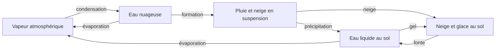

# Atmosphère volumétrique GPU

TerraGPU associe désormais deux domaines : une surface en heightfield 2.5D pour
le relief et les fluides, et une atmosphère véritablement 3D. La grille
atmosphérique contient **96 × 96 × 64 = 589 824 voxels**. Chaque position
horizontale possède plusieurs niveaux d'air qui évoluent séparément. Le vent
possède trois composantes, dont une vitesse verticale, et les échanges lisent
les voisins selon les trois axes. Les coupes visibles sont des diagnostics de
ce volume, pas les seules couches simulées.

Il s'agit d'une mini-simulation qualitative destinée à l'exploration visuelle.
La représentation et les coefficients sont simplifiés : ni les distances, ni
les temps, ni les vitesses affichées ne constituent une calibration
météorologique à l'échelle d'un paysage réel.

## Fonctionnement

Les états évoluent dans des buffers de stockage WebGPU. Le CPU transmet les
paramètres et ordonne les passes ; le transport et les mises à jour des cellules
sont calculés sur le GPU.

- L'advection semi-lagrangienne avec interpolation trilinéaire transporte le
  vent dans les trois dimensions. L'eau atmosphérique
  utilise un transport conservatif par volumes finis : un flux sortant par
  une face est exactement le flux entrant de la cellule voisine. Un limiteur
  borne les sorties par la quantité disponible dans la cellule donneuse.
  Une reconstruction limitée des concentrations réduit la diffusion des
  panaches ; les flux rapides utilisent une approximation plus robuste pour
  préserver les quantités disponibles.
- La température est transportée sous forme de température potentielle
  simplifiée, `θ = T(K) + 0,16 × z`, par flux conservatifs. Retrouver ensuite
  la température à l'altitude d'arrivée représente le refroidissement d'une
  parcelle qui monte et le réchauffement d'une parcelle qui descend, sans
  ajouter une seconde correction adiabatique indépendante.
- Les échanges thermiques entre sol et air, le chauffage solaire, le
  refroidissement radiatif, l'albédo des matériaux et l'inertie thermique
  produisent des contrastes de température locaux.
  Une passe dédiée débite la chaleur sensible de chaque cellule de surface
  et crédite exactement cette énergie à la première cellule d'air de sa
  colonne, avec correction des aires représentées. L'échange tient compte
  des deux capacités thermiques et de l'isolation par la neige. Son taux
  augmente avec le vent local et le contraste chaud sol–air, tout en restant
  actif au repos. Une relaxation exponentielle borne chaque transfert.
- La flottabilité compare la température locale à la moyenne de sa couche
  d'altitude pour créer des mouvements verticaux. Elle prend aussi en compte
  l'humidité de l'air et le poids de l'eau condensée. Le transport vertical
  s'accompagne d'un changement de température adiabatique ; le refroidissement
  d'une parcelle sèche est distinct du profil initial de température ambiante.
  **Convection response** multiplie cette accélération (4× par défaut) pour
  l'échelle illustrative du paysage. Elle utilise la température après les
  échanges de chaleur sensible et les changements de phase du pas courant ;
  le multiplicateur ne crée ni chaleur ni eau.
- Une projection de pression par gradient conjugué préconditionné (PCG), avec
  20 itérations et ses réductions entièrement sur GPU, réduit la divergence
  du champ de vitesse. Les frontières horizontales sont
  périodiques ou fermées au choix ; le terrain et le plafond sont solides.
- La condensation et l'évaporation des nuages couplent le transfert d'eau à
  la chaleur latente : la saturation est réévaluée avec ce changement de
  température par une résolution itérative bornée par les réserves disponibles.
  La pluie qui se réévapore utilise le même couplage et refroidit l'air.
  La croissance des gouttelettes transforme ensuite plus lentement l'eau
  nuageuse en précipitations, avec une accélération dans les nuages denses ou
  en présence de précipitations existantes. Il n'y a plus de seuil de
  condensat sous lequel toute conversion en pluie reste bloquée.
- Le couplage avec la surface produit de la pluie ou de la neige suivant les
  conditions thermiques, permet le gel de l'eau et restitue de l'eau liquide
  lors de la fonte.

Chaque voxel conserve huit flottants : trois composantes du vent et une
température, puis la vapeur, l'eau nuageuse, la pluie et la neige. Les
précipitations se déplacent entre niveaux par sédimentation verticale. La
surface conserve séparément neige et glace en équivalent eau : lorsqu'une
quantité fond, elle est retirée du réservoir solide et ajoutée au champ
`water` des fluides. Ce liquide participe ensuite à l'écoulement existant.
La disparition visuelle de neige n'est donc pas seulement une modification de
couleur.

Pour transmettre une précipitation de la grille atmosphérique à la surface
fine, le couplage utilise une interpolation bilinéaire dont les poids sont
normalisés selon les aires représentées. Cette répartition préserve le budget
de dépôt et évite d'imprimer les limites des colonnes atmosphériques dans la
neige. La température des précipitations et l'humidité utilisées en surface
sont également interpolées. L'échange de chaleur sensible utilise le profil
vertical courant de la colonne, reconstruit à la hauteur de chaque cellule
fine, et un transfert d'énergie commun aux deux réservoirs. La
résolution de la dynamique atmosphérique reste de 96 × 96 × 64.

## Glace solide sous l'eau

La glace est toujours une couche solide attachée au terrain. Le modèle
conserve sa masse sur la grille fine en équivalent eau ; son épaisseur
géométrique est cet équivalent divisé par 0,917. La hauteur du lit solide
inclut donc le terrain et cette épaisseur de glace. L'eau liquide restante
circule au-dessus, et le rendu, le picking et les écoulements utilisent cette
même disposition.

Le refroidissement consomme progressivement le liquide disponible pour
former de la glace. La quantité gelée dépend de la chaleur retirée : le
changement de phase libère de la chaleur latente et limite la croissance à
chaque pas. Le budget sensible local, obtenu à partir de la température et
d'une capacité thermique effective, borne le changement de phase ; celui-ci
ramène progressivement la température vers 0 °C. Un refroidissement prolongé
peut transformer toute la colonne
d'eau en solide. Inversement, la chaleur disponible fait fondre la glace,
abaisse le lit solide et rend la même masse d'équivalent eau au liquide.
La géométrie peut changer avec la différence de densité, mais la masse d'eau
ne change pas pendant ces transferts.

La neige qui tombe dans une réserve liquide rejoint cette réserve après
fusion, avec un refroidissement latent. Elle n'y forme pas une couche de
neige suspendue. Sur un terrain sans eau liquide, elle reste un réservoir
solide qui peut s'accumuler puis fondre avec le réchauffement. Un écoulement
ou un ajout d'eau qui inonde une réserve de neige provoque également cette
fusion au pas de surface, même si le calcul atmosphérique est désactivé.

Cette disposition est une **simplification volontaire du modèle 2.5D** : un
lac réel peut porter une couverture de glace flottante, ce que cette version
ne représente pas. Chaque colonne possède un seul réservoir liquide au-dessus
du solide. Il n'y a pas de flottabilité ou de mécanique de plaques de glace,
de circulation sous une couverture flottante, ni d'empilement de couches
liquides. La glace immergée au fond ne sert pas de couvercle isolant au-dessus
de l'eau.

## Cycle de l'eau fermé et frontières

**Closed water cycle est activé par défaut** (`config.closedWaterCycle = true`).
L'eau se déplace entre réservoirs internes :

L'évaporation retire uniquement l'eau liquide disponible, puis crédite cette
même quantité au budget destiné à l'air. La vapeur en attente d'injection
reste un réservoir comptabilisé, y compris lorsqu'une colonne ne contient pas
d'air disponible. La chaleur peut accélérer ce transfert, elle ne crée pas
d'eau. **Solar evaporation** règle son coefficient de 0 à 1, avec 0,25 par
défaut. L'ancien curseur **Water Evaporation** devient **Extra evaporation
(returned to air)** dans ce mode : son prélèvement rejoint également l'air.

Le mode fermé force les bords de surface à **Block all**, suspend la pluie
manuelle et désactive tout rappel d'humidité vers une valeur imposée, même
si la température et le vent utilisent le mode forcé. Les contrôles manuels
incompatibles affichent l'état effectif et sont désactivés. Leurs valeurs
choisies restent mémorisées pour le retour au mode ouvert.

Les **frontières de l'atmosphère** sont indépendantes de celles de l'eau de
surface :

| Réglage      | Ce qui arrive au bord horizontal                                                                                        | Conséquence sur l'eau                                          |
| ------------ | ----------------------------------------------------------------------------------------------------------------------- | -------------------------------------------------------------- |
| Periodic     | L'air qui sort à droite rentre à gauche ; celui qui sort devant rentre derrière, avec les mêmes quantités transportées. | Aucune perte vers l'extérieur : les bords opposés sont reliés. |
| Closed walls | La vitesse normale au mur est bloquée ; l'air doit circuler à l'intérieur du domaine.                                   | Aucun flux d'eau atmosphérique à travers les murs.             |

Le sol et le plafond sont fermés dans les deux cas. La pluie qui atteint le
sol rejoint les réserves de surface. Une frontière périodique ne signifie
donc pas que le monde est ouvert : elle referme les axes horizontaux sur
eux-mêmes. Dans le mode fermé, l'eau liquide de surface reste contenue par
ses propres bords bloquants, même lorsque l'air utilise les bords périodiques.

La désactivation de **Closed water cycle** rend de nouveau actifs les
réglages de pluie manuelle, de frontières de surface et, en mode forcé, de
rappel d'humidité. Ces fonctions peuvent alors apporter ou retirer de l'eau.
Cela ne transforme pas les frontières atmosphériques en bords ouverts :
leur sélection périodique ou fermée continue de s'appliquer.

Le panneau **Water inventory** mesure la somme de l'eau liquide, des solides,
de la vapeur, des nuages, des précipitations en vol et des transferts en
attente. Entre interventions, l'évolution fermée conserve ce total à la
précision des calculs flottants. La répartition entre réservoirs peut changer
fortement pendant que le total reste stable. Les différences d'arrondi et
leur accumulation se lisent dans l'écart affiché, elles ne doivent pas être
confondues avec une nouvelle source physique.

Les pinceaux ajoutant ou effaçant de l'eau, les presets, **Restart air** et les réinitialisations sont des
interventions volontaires : ils peuvent ajouter, retirer ou remplacer de
l'eau, et définissent un nouveau bilan de référence. Redémarrer l'air humide
apporte par exemple un nouvel inventaire de vapeur même si le sol est
préservé. Comparer la dérive seulement après la fin de ces interventions.

## Météo émergente et mode forcé

**Le mode émergent est activé par défaut** (`config.emergentWeather = true`).
Il n'applique aucun rappel continu de la température, de l'humidité ou du vent
vers les curseurs. Ces valeurs définissent l'état initial de l'air et sont
appliquées par **Restart air** ou par un preset. Le vent horizontal initial
vaut zéro par défaut. À chaque altitude, température et humidité initiales
sont uniformes horizontalement ; aucune perturbation sinusoïdale ou aléatoire
n'est ajoutée. Le volume évolue ensuite à partir de cet état, du
relief, des échanges sol–air, des changements de phase et des sources
d'énergie.

**Initial lower-air stability** règle le profil thermique de départ. À 0 %, la
couche basse est neutre pour une parcelle sèche ; à 100 %, son gradient vaut
0,12 °C par unité de hauteur. Le défaut de 12,5 % donne 0,155, proche du gradient
adiabatique sec de 0,16. Entre les hauteurs 40 et 65, le gradient rejoint
progressivement 0,04 dans la couche haute, plus stable. Ce profil n'est pas
entretenu en mode émergent : les ascendances, le mélange et les échanges le
font évoluer. Modifier sa stabilité demande **Restart air**, comme les autres
conditions initiales. En mode forcé, il sert aussi de profil de référence.

**Convection response** s'applique immédiatement et règle la vitesse de
réaction aux écarts thermiques et hydriques. L'air chaud monte et la projection
de pression fait converger l'air voisin, sans vent horizontal supplémentaire
imposé. Un monde parfaitement symétrique, sans contraste de surface, peut
rester calme ; les lacs, les pentes et les pinceaux thermiques fournissent des
déclencheurs locaux.

Le soleil reste une entrée externe : son intensité, son élévation et son
azimut règlent l'échauffement selon l'exposition du sol. Le refroidissement
radiatif règle les pertes de chaleur. Ces paramètres s'appliquent immédiatement
pendant la simulation. Il n'y a pas de cycle jour/nuit automatique impliqué
par ces curseurs. La température et le vent sont des résultats dynamiques ;
leur évolution ne garantit pas une circulation spectaculaire sur un terrain
uniforme à chaque instant.

**Surface heating contrast** accentue la répartition locale du chauffage
solaire, de 1× à 10×, avec 3× par défaut. Les cellules bien exposées, absorbantes
et de faible capacité thermique reçoivent une plus grande part du budget.
Le gain règle un renforcement exponentiel borné de cette préférence ; il ne
multiplie pas directement les watts de chaque cellule. Deux réductions GPU
normalisent ensuite les poids pour préserver la somme de l'énergie absorbée
à 1×, à état de surface et soleil identiques. Une cellule non éclairée ne
reçoit rien et un monde uniforme reste uniforme. **Solar heating** reste le
réglage distinct de la puissance totale. Les deux curseurs s'appliquent en direct.

Les propriétés thermiques effectives sont partagées entre l'atmosphère et
les pinceaux de surface dans `surfaceThermal.wgsl`. La capacité de base passe
progressivement de 1,5 pour la roche à 0,6 pour une couche de sable sec de
0,05 unité. S'y ajoutent les réserves d'eau, de glace et de neige, pondérées
respectivement par 8, 5 et 2. Les albédos cibles valent 0,18 pour la roche,
0,38 pour le sable, 0,08 pour l'eau, 0,55 pour la glace et 0,82 pour la neige,
avec des transitions continues selon leur couverture. Le sable se réchauffe
donc vite malgré une absorption plus faible que la roche ; l'eau conserve
une forte inertie. Ces valeurs règlent une simulation illustrative, sans
prétendre représenter les propriétés mesurées de matériaux réels.

Le contraste d'inertie thermique entre l'eau et les terres permet des
circulations locales. Une étendue d'eau fournit de la vapeur, qui peut gagner
les terres et monter avec l'air chaud. Le refroidissement pendant l'ascension
favorise la condensation ; la chaleur libérée soutient à son tour le mouvement
ascendant. La conversion progressive de l'eau nuageuse en précipitations
laisse du temps à ces masses d'air pour se déplacer, tout en drainant aussi
lentement les faibles condensats. Le modèle
cherche ainsi à faire émerger des panaches et des nuages convectifs à partir
des échanges, sans injecter de nuages ni imposer leur trajectoire.

Le cycle et le rendu partagent une échelle de condensat de 0,001 dans
`cloudPhysics.wgsl`. La conversion spontanée suit le taux continu
`0,018 × qc / (qc + 0,001)` : une brume très fine se vide plus lentement qu'un
nuage dense. L'air sec peut aussi réévaporer le condensat en vapeur, avec
absorption de chaleur latente. Le rendu intègre l'extinction sur la longueur
du rayon, sans seuil qui masquerait arbitrairement une réserve d'eau. À cette
échelle de condensat, une couche de 10 unités présente environ 16 % d'opacité ;
les couches épaisses ou denses peuvent rester opaques. Ces mécanismes permettent
la dissipation et le renouvellement des nuages, sans garantir l'absence de
brouillard ou de nappes sous une couche d'air stable.

Les échanges thermiques restent locaux ; il n'y a pas de calcul séparé de
température à chaque profondeur de l'eau, de la glace et de la neige, ni
d'ombre des nuages sur le chauffage solaire du sol. La glace est placée sous
le liquide et ne bloque donc pas l'évaporation de sa surface libre. La neige
sur un terrain sec réduit en revanche les échanges thermiques du sol avec
l'air.

Le **mode forcé**, optionnel, rétablit le rappel continu de l'air vers les
références de température et de vent. Le rappel d'humidité n'est actif que
si **Closed water cycle** est désactivé ; sinon son curseur reste une
condition initiale. Le mode forcé apporte de la chaleur et du mouvement, et
peut également apporter ou retirer de l'eau en mode ouvert.

En mode émergent ou en cycle fermé, changer un preset redémarre l'air avec ses conditions initiales et réactive la
météo. **Restart air** applique les curseurs courants de la même manière. Ces
actions conservent le terrain, sa température, l'eau liquide, la neige et la
glace. Elles remplacent l'état atmosphérique et ne constituent pas une
évolution fermée de ce dernier. **Reset Weather** est la réinitialisation plus
large qui efface aussi neige et glace.

## Temps et résolutions

Les fluides de surface utilisent une horloge à pas fixe de 1/60 s, avec un
maximum de huit pas par image. L'atmosphère et ses échanges de gel et de fonte
utilisent une horloge à pas fixe de 1/30 s, limitée à quatre pas par image.
La fusion de neige inondée par un écoulement ou un pinceau est également
traitée lors des pas de surface. Ces horloges
suivent le temps écoulé, plutôt que le nombre d'images affichées. Les plafonds
évitent une accumulation de travail après un ralentissement ou un onglet
inactif.

Le facteur **Simulation Speed** général module les deux horloges et **Weather
speed** module en plus celle de l'atmosphère. En surcharge durable, ces plafonds
peuvent ralentir le temps simulé par rapport au temps réel. La pause générale
suspend les deux domaines ; la seule désactivation de la météo laisse évoluer
les fluides au-dessus de la glace déjà présente et la fusion de neige inondée,
mais suspend les échanges thermiques atmosphériques de gel et de fonte.

La résolution atmosphérique est indépendante des 2048 × 2048 cellules de
surface. **Mesh Resolution** règle seulement la finesse du maillage affiché.
Les nuages et les coupes lisent l'état GPU du volume ; le rendu n'introduit pas
une simulation CPU parallèle.

## Commandes

Le panneau **3D Atmosphere** est ouvert au démarrage. Les noms de l'interface
restent en anglais pour correspondre aux autres panneaux.

| Commande                    | Sens et plage                                                                                                              |
| --------------------------- | -------------------------------------------------------------------------------------------------------------------------- |
| Simulate weather            | Active ou suspend le calcul atmosphérique et son couplage.                                                                 |
| Closed water cycle          | Ferme le bilan hydrique ; actif par défaut. Suspend pluie externe, ouverture des bords de surface et rappel d'humidité.    |
| Atmosphere boundaries       | Bords horizontaux périodiques (0, défaut) ou murs fermés (1).                                                              |
| Water inventory             | Inventaire total, écart au bilan de référence et répartition dans les réservoirs.                                          |
| Mode météo                  | Émergent par défaut ; le mode forcé maintient température et vent, ainsi que l'humidité seulement en cycle ouvert.         |
| Air temperature             | Température initiale, de −25 à 35 °C ; référence continue en mode forcé.                                                   |
| Relative humidity           | Humidité initiale, de 0 à 140 % ; référence continue uniquement en mode forcé avec cycle ouvert.                           |
| Wind speed                  | Vent horizontal initial, de 0 à 30 unités de simulation par seconde ; référence continue en mode forcé.                    |
| Wind heading                | Direction de déplacement du vent initial ou forcé, de 0 à 360°. Il ne s'agit pas de sa provenance météorologique.          |
| Initial lower-air stability | Stabilité de la couche basse, de 0 % (neutre) à 100 % (stable), défaut 12,5 %. S'applique au redémarrage en mode émergent. |
| Convection response         | Multiplicateur de flottabilité de 0 à 8, défaut 4. S'applique immédiatement ; 0 désactive cette accélération.              |
| Solar heating               | Intensité relative du chauffage solaire, de 0 à 3.                                                                         |
| Solar evaporation           | Coefficient d'évaporation de 0 à 1, défaut 0,25 ; l'eau transférée est prélevée au sol puis restituée à l'air.             |
| Sun elevation / azimuth     | Élévation et azimut du soleil ; déterminent l'exposition au chauffage.                                                     |
| Radiative cooling           | Intensité relative des pertes de chaleur radiatives.                                                                       |
| Weather speed               | Multiplicateur de temps météorologique, de 0,25 à 4.                                                                       |
| Explore atmosphere          | Nuages volumiques ou coupe horizontale de température, d'humidité ou de vitesse du vent.                                   |
| Slice altitude              | Hauteur relative de la coupe dans le volume, de 0 à 100 %.                                                                 |
| Show volumetric clouds      | Visibilité des nuages, sans désactiver leur simulation.                                                                    |
| Show 3D wind vectors        | Affichage de directions locales du vent, y compris sa composante verticale.                                                |
| Restart air                 | Applique les conditions initiales à l'air ; préserve terrain, température du sol, eau, neige et glace.                     |
| Reset Weather               | Réinitialise l'air aux paramètres courants et efface neige et glace ; conserve terrain et eau liquide.                     |

La coupe parcourt un volume haut de 100 unités de scène, en restant entre
0,5 et 99,5 pour les extrêmes du curseur. La température va du bleu à −30 °C
au rouge à +35 °C, en passant par le cyan/jaune autour de 0 °C. L'humidité va
du brun sec au cyan à saturation ; l'eau condensée blanchit la couleur. Pour
le vent, le bleu correspond à une vitesse nulle, le vert/cyan à 12 u/s et
l'orange à 32 u/s. Les marqueurs de vent sont cyan pour les descentes et dorés
pour les ascendances. Les couleurs saturent aux bornes de leurs échelles.
La vue de vent affiche les vecteurs même si leur case est décochée ; cette
case permet aussi de les superposer aux autres vues.

Les presets **Mild**, **Snow**, **Thaw** et **Storm** proposent respectivement
un départ doux, froid et humide, chaud pour explorer le dégel, et venteux et
humide. Leurs paramètres sont visibles dans les curseurs synchronisés.
En mode émergent, ils ne verrouillent pas le résultat météo au fil du temps.

**Manual Rain** est la source de pluie manuelle historique. Elle peut ajouter
de l'eau indépendamment de la condensation atmosphérique en cycle ouvert.
Elle est suspendue et ses contrôles sont désactivés en cycle fermé.

## Vérifications manuelles

Ces scénarios décrivent les comportements à vérifier dans un navigateur WebGPU.
Ils ne constituent pas une validation scientifique du modèle.

1. **Neige et gel.** Laisser **Manual Rain** désactivé. Sélectionner **Snow**.
   Ajouter une petite réserve d'eau avec la brosse Water et
   laisser tourner. Observer l'apparition de nuages et de neige au sol ainsi
   que le gel de l'eau dans les conditions froides. L'accumulation dépend du
   relief, de l'humidité et du temps simulé.
2. **Fonte.** Sur ce même état, choisir **Thaw** sans utiliser **Reset Weather**.
   Le preset redémarre l'air et conserve les réserves solides. Observer le
   réchauffement avec une coupe de température, puis la diminution de la
   couverture solide et le retour d'eau liquide. Le sol garde son inertie et
   peut demander du temps pour se réchauffer. Une pente permet à l'eau libérée
   de s'écouler ; une frontière de surface ouverte peut l'évacuer lorsque le
   cycle fermé est désactivé. Le volume local visible n'est
   donc pas un bilan hydrique global.
3. **Volume et vent.** Choisir **Storm**, afficher les vecteurs, puis parcourir
   les coupes de température, d'humidité et de vent. Déplacer **Slice altitude**
   près du bas, du milieu et du sommet. Les champs doivent différer selon
   l'altitude. En mode émergent, modifier **Wind heading** ne doit pas imposer
   immédiatement un vent : utiliser **Restart air** pour appliquer ce nouvel
   état initial. En mode forcé, observer la réponse progressive au curseur.
4. **Émergence et soleil.** Partir d'un relief avec des pentes variées, régler
   le vent initial à zéro et cliquer **Restart air** en mode émergent. Modifier
   l'intensité ou la direction du soleil. Observer les températures locales
   puis les ascendances et les mouvements horizontaux. Les curseurs de
   température et de vent initiaux ne doivent pas agir comme des thermostats.
5. **Continuité de la neige.** Sous une chute de neige, déplacer la caméra près
   du sol et observer les transitions de couverture. Les frontières régulières
   des cellules de l'atmosphère ne doivent pas apparaître comme des marches
   systématiques dans le dépôt. Comparer avec une coupe atmosphérique pour
   distinguer un gradient météo réel d'un défaut de rééchantillonnage.
6. **Pause.** Cliquer **Pause** alors que nuages et neige évoluent. Attendre
   quelques secondes, déplacer la caméra, puis reprendre. L'état météo doit
   rester figé pendant la pause et reprendre sans rattrapage massif.
7. **Désactivation.** Décocher **Simulate weather**. L'eau de surface doit
   continuer à évoluer si la pause générale n'est pas active ; les échanges
   météo et l'état atmosphérique restent suspendus. Réactiver pour reprendre.
8. **Redémarrage de l'air.** Avec neige, glace et eau présentes, cliquer
   **Restart air**. Seul le volume atmosphérique doit repartir des conditions
   initiales ; les réserves et la température du sol doivent être conservées.
9. **Réinitialisation complète.** Avec une réserve solide existante, cliquer
   **Reset Weather**. La neige et la glace sont effacées et l'air retrouve les
   conditions de référence courantes. Le relief et l'eau liquide sont
   conservés. Vérifier également les commandes de remise à zéro du terrain
   et le changement de résolution du maillage.
10. **Bilan du cycle fermé.** Garder **Closed water cycle** activé, introduire
    une réserve d'eau puis cesser les interventions. Attendre la mesure du
    nouveau bilan de référence. Laisser évoluer évaporation, condensation,
    précipitations et changements de phase ; surveiller le total et sa
    répartition. Refaire l'essai avec les deux choix de frontières
    atmosphériques. Les échanges internes doivent préserver le total aux
    arrondis numériques près.
11. **Retour au mode ouvert.** Désactiver le cycle fermé, choisir une pluie
    manuelle et des bords de surface ouverts, puis réactiver le cycle fermé.
    Vérifier que la pluie est suspendue et les bords bloqués, sans effacer les
    réglages choisis. Les retrouver en repassant au mode ouvert. En mode forcé
    fermé, l'humidité doit rester indiquée comme une condition initiale.
12. **Glace au fond.** Faire refroidir un lac : la couche solide doit croître
    depuis le terrain en consommant l'eau liquide. Ajouter de l'eau ensuite :
    elle doit s'écouler au-dessus de la glace sans soulever cette dernière.
    Réchauffer pour vérifier que le lit de glace s'amincit et restitue du
    liquide. Comparer la neige tombant sur l'eau, qui la rejoint en fondant,
    à la neige conservée sur un terrain sec.

## Vérifications exécutées sur GPU

Démarrer `npm run dev`, puis ouvrir `/water-sim/tests/atmosphere.html` sur ce serveur
local dans un navigateur WebGPU. La page exécute plus de vingt vérifications
en compilant les shaders, en lançant les passes et en relisant les buffers
GPU. Elle affiche chaque résultat et s'arrête sur un échec.

La page `/water-sim/tests/convection.html` vérifie le départ uniforme au repos,
le profil presque neutre sous la couche stable, le maintien du calme sans
source de contraste, le transfert égal et opposé de chaleur sur une grille
non divisible, et la réaction plus rapide à un même chauffage local pour les
réponses 1×, 4× et 8×. Les tests de convection existants déclenchent maintenant
le mouvement par une zone de surface chaude, au lieu du bruit initial retiré.

La page `/water-sim/tests/heating-clouds.html` compare les températures de la
roche, du sable et de l'eau, puis le budget solaire aux contrastes 1×, 3× et 10×
sur une grille 97². Elle vérifie l'effet de l'orientation du soleil, le calme
thermique sans source et l'uniformité d'un sol homogène. Les scénarios nuageux
contrôlent la bruine sous l'ancien seuil, le retour de l'eau au sol et la
réévaporation avec refroidissement. Un rendu GPU hors écran vérifie aussi
l'opacité effective d'une couche faible et d'une couche dense.

La page `/water-sim/tests/water-cycle.html` vérifie en plus la boucle complète
sur plusieurs milliers de pas : une réserve liquide alimente un air initialement
sec, condense, précipite au sol puis s'évapore à nouveau. Seuls le soleil et le
refroidissement changent pendant ce scénario, sans remise à zéro ni apport d'eau.
Elle compare les inventaires avant et après les échanges, dans les deux modes
de frontière, y compris avec une surface 97² non divisible par 96. Elle couvre
la récupération de l'eau quand le relief envahit l'atmosphère, la vapeur en
attente, le moteur de fluides avec météo désactivée et le compteur GPU confronté
à une somme CPU indépendante.

La page `/water-sim/tests/bottom-ice.html` contrôle l'intégration de la glace
comme lit solide sous le liquide. Elle suit le gel progressif jusqu'à la
solidification complète d'une petite réserve, la fonte complète et la limite
thermique empêchant le gel de réchauffer la surface au-delà de 0 °C. Elle
vérifie aussi la fusion de neige inondée ou tombant sur l'eau, y compris sur
une grille de surface non divisible par la résolution atmosphérique. Les
contrôles d'intégration vérifient que l'eau s'écoule au-dessus du lit sans
déplacer la réserve de glace, avec conservation de l'eau, et que la
géométrie rendue et pointée reste attachée au terrain lorsque le niveau
liquide change.

La page `/water-sim/tests/air-masses.html` suit un lac et des terres avec un
vent initial nul. Elle mesure les vitesses ascendantes et horizontales,
l'humidification en altitude, le transport de vapeur au-delà des berges et
la formation de nuages au-dessus des terres. Un scénario distinct initialise
un nuage dans un air saturé en mouvement pour vérifier qu'il conserve une
part importante de son condensat pendant son transport, au lieu de le
convertir immédiatement en pluie. Les deux scénarios vérifient également
la conservation de l'inventaire d'eau et les valeurs finies dans les buffers.
Des contrôles mesurent la réduction de divergence par la projection de
pression, le retour de nuages éloignés du lac au cours de plusieurs minutes,
et le déplacement d'un nuage au-delà de son emplacement initial. Le transport
d'un air sec uniforme sans apport d'énergie doit également préserver sa
température, afin de détecter un réchauffement purement numérique.

Les vérifications couvrent notamment le volume alloué, les valeurs finies,
les différences selon l'altitude, le mouvement vertical, la condensation, le
gel, la fonte de la neige et de la glace et **l'augmentation effective de l'eau
liquide après fonte**. Elles vérifient également le transport de neige entre
couches, la pause, la désactivation, la réinitialisation et l'intégration des
vues de rendu, du picking et du changement de maillage. Le test de fonte
initialise volontairement un sol chaud pour isoler le transfert de phase de
la vitesse de réchauffement de l'air.

Les régressions vérifient également qu'un air au repos développe une circulation,
que modifier les curseurs initiaux ne force pas le mode émergent, et qu'un monde
sec ne reçoit pas d'humidité artificielle. Une surface 257² teste la conservation
du dépôt lissé malgré le rapport non entier avec la grille 96². Un autre contrôle
vérifie que les petits apports de fonte survivent aux étapes suivantes du moteur
d'eau : l'ancien seuil de suppression de 10⁻⁴ les effaçait trop tôt.

Ces contrôles utilisent une petite grille de surface pour limiter leur coût ;
ils ne suffisent pas à établir les performances de la grille 2048² sur tous
les GPU. Consulter les résultats de l'exécution courante : la présence de la
page de test ne signifie pas que ses contrôles ont réussi sur le navigateur
utilisé.

Surveiller aussi la console pendant les manipulations manuelles : une erreur
de validation WebGPU ou une perte de périphérique invalide l'essai.
`npm run typecheck`, `npm run lint` et `npm run build` vérifient les sources
TypeScript et le paquetage, mais ne remplacent pas l'exécution sur un GPU.

## Limites et ancien plan climat

Les échanges de phase restent simplifiés. Le transport de l'eau utilise des
flux conservatifs ; l'advection semi-lagrangienne, plus diffusive, reste
utilisée pour le vent. Le dépôt des précipitations est
normalisé par aire et les changements de phase transfèrent le même
équivalent eau entre réservoirs. Le bilan fermé reste soumis aux arrondis
des flottants GPU et doit être évalué avec le diagnostic courant et les
contrôles de régression, plutôt que supposé exactement constant bit à bit.

L'eau des cellules d'air recouvertes par le relief est récupérée à la surface.
Au-dessus du plafond de 100 unités, la surface n'a plus de colonne d'air
disponible : les transferts en attente restent comptabilisés. Les échanges
de chaleur sont simplifiés ; le
modèle ne revendique pas non plus un bilan énergétique strictement conservatif.

Le soleil, le refroidissement radiatif et la chaleur de la lave sont des
entrées ou sorties d'énergie. Le mode ouvert autorise des sources et des
pertes d'eau par ses contrôles manuels, ses bords de surface et son éventuel
rappel d'humidité. Les interventions de l'utilisateur changent également le
bilan de référence. La conservation d'eau du cycle fermé n'est pas une
validation de prévisions météorologiques réelles.

Le terrain reste une surface : cette version ne représente pas les grottes,
les surplombs, les vagues déferlantes ou les volumes d'eau libre complets. La
glace constitue un lit solide sous le liquide, sans flottaison ni mécanique
glaciaire ou de fracture. Cette version n'ajoute pas de
végétation, de sol hydrologique ou de modèle de prévision synoptique.

Le dossier [climate-vegetation](climate-vegetation/README.md) est une feuille de
route antérieure fondée sur une atmosphère 2.5D. Ses grilles, contrats de
données, objectifs de conservation et étapes sur la végétation décrivent ce
plan, et non des fonctionnalités livrées par l'atmosphère volumétrique actuelle.
